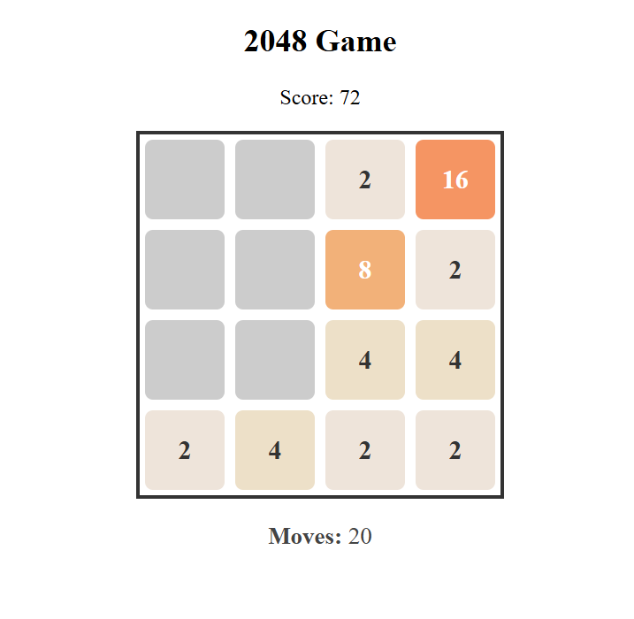
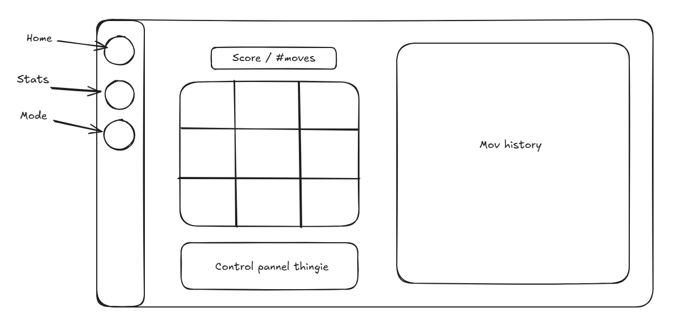

# 🎮 2048 AI – Angular-Based Web Game

A web-based version of the classic puzzle game **2048** — with a twist.

> ✅ **Play manually now.**  
> 🧠 **Coming soon:** Challenge an **unbeatable rule-based AI**, or watch a **self-learning DQN agent** master the game over time.

---

## 🚧 Project Status

✅ Manual play mode  
🛠 AI modules in progress (rule-based + reinforcement learning)  
🧪 DQN integration planned

---

## 📦 Features

### ✅ Available Now

- Classic 2048 mechanics: tile sliding, merging, scoring
- Responsive UI using Angular
- Move history panel (see what moves you made)

### 🔜 Coming Soon

- 🧠 **Rule-based AI**: Watch or compete with a near-optimal AI based on handcrafted logic
- 🤖 **DQN (Deep Q-Network)**: A self-learning AI that trains over time via rewards
- 🏆 Game modes:
  - Player vs AI
  - AI vs AI
  - Auto-train mode
- 📊 Visualization of learning progress (score, Q-values, move choices)
- 💾 Save/Load agent memory

---

## 💻 Tech Stack

| Layer    | Tech                         |
| -------- | ---------------------------- |
| Frontend | Angular 17+, TypeScript      |
| UI       | Tailwind CSS (will add soon) |
| AI Logic | (Coming soon) TensorFlow.js  |

---

## 🚀 Getting Started

### Prerequisites

- Node.js (v16+)
- Angular CLI

```bash
npm install -g @angular/cli
```

```bash
git clone https://github.com/AvoCahDoe/2048.git
cd 2048-angular-ai
npm install
ng serve

```

> Then open your browser at http://localhost:4200

### ✨ Screenshots



Goal Design : 




