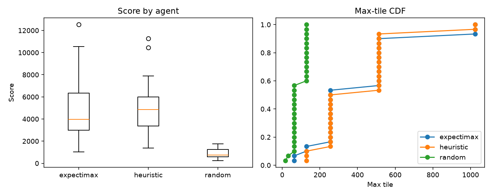
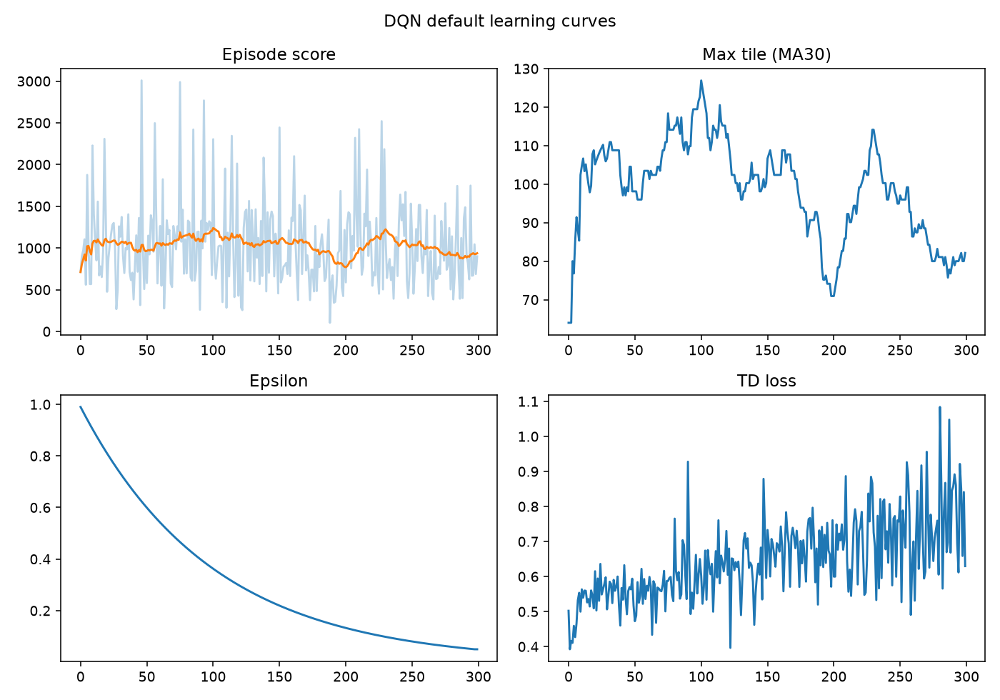
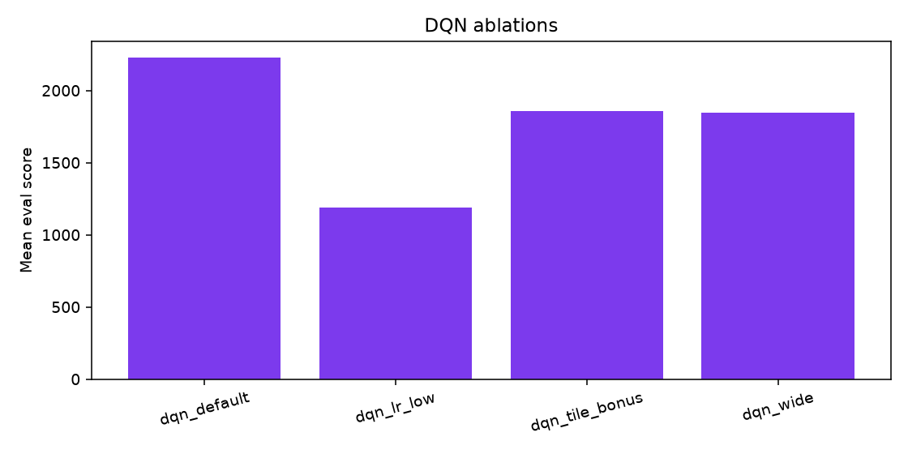

# 2048 Research Lab

PhD-portfolio research project: **simulate, search, and learn** policies for classic 2048 — Monte Carlo bakeoffs, expectimax, Double DQN with ablations, and graph-heavy analysis — plus a polished Angular playable companion.

> Browser: human play + heuristic spectator.  
> Python (`uv`): Gymnasium env, agents, training, notebooks, Streamlit dashboard.

---

## Methods

| Agent | Idea |
| ----- | ---- |
| Random | Uniform legal moves (baseline) |
| Heuristic | Empty cells, snake weights, smoothness, monotonicity |
| Expectimax | Shallow probabilistic search over tile spawns |
| Double DQN | CNN Q-network, replay buffer, target net, ε-greedy |

**Ablations** (YAML under `experiments/configs/`): learning rate, max-tile reward bonus, network width.

---

## Quick start (Python / `uv`)

```bash
cd 2048
uv sync --extra dev

# Smoke test
uv run python scripts/smoke_test.py

# Agent bakeoff (Monte Carlo)
uv run twenty48-sim --bakeoff --episodes 30 --depth 1

# Train Double DQN (CPU-friendly demo length)
uv run twenty48-train --config experiments/configs/dqn_default.yaml

# Ablations
uv run twenty48-train --config experiments/configs/dqn_lr_low.yaml
uv run twenty48-train --config experiments/configs/dqn_tile_bonus.yaml
uv run twenty48-train --config experiments/configs/dqn_wide.yaml

# Static plots for slides / README
uv run python scripts/export_plots.py

# Interactive dashboard
uv run streamlit run scripts/dashboard.py

# Notebooks
uv run jupyter lab notebooks/
```

Raise `episodes` in the YAML configs to scale beyond the CPU demo defaults.

---

## Results (shipped demo runs)

### Agent bakeoff — 30 episodes, seed 42, expectimax depth 1

| Agent | Mean score | Max tile (mean / best) |
| ----- | ---------- | ---------------------- |
| random | 894 | 89 / 128 |
| heuristic | **4970** | 405 / **1024** |
| expectimax | 4928 | 405 / 1024 |



Heuristic and shallow expectimax both crush random. Deeper expectimax (`--depth 2+`) trades compute for strength.

Artifacts: `experiments/runs/bakeoff/`.

### Double DQN — short CPU demos + ablations

Final greedy eval (30 games) after training:

| Run | Episodes | Mean score | Mean max tile | Best max tile |
| --- | -------- | ---------- | ------------- | ------------- |
| dqn_default | 300 | **2229** | 174 | 512 |
| dqn_lr_low | 200 | 1189 | 97 | 256 |
| dqn_tile_bonus | 200 | 1856 | 156 | 256 |
| dqn_wide | 200 | 1849 | 147 | 512 |





Even short DQN runs beat random (~894) and approach heuristic play with longer training. Checkpoints live under each run’s `checkpoints/` (gitignored; retrain to regenerate). Metrics: `experiments/runs/*/metrics.jsonl`.

---

## Project layout

```
2048/
  pyproject.toml          # uv project (package: twenty48)
  src/twenty48/
    env/                  # Gymnasium 2048
    agents/               # random, heuristic, expectimax, DQN
    sim/                  # Monte Carlo + bakeoff
    train/                # DQN loop, checkpoints, metrics
    viz/                  # Plotly helpers
  scripts/dashboard.py    # Streamlit
  notebooks/              # Showcase analysis
  experiments/configs/    # Train / ablation YAMLs
  front-end/              # Angular companion game
```

---

## Deploy

| Surface | URL |
| ------- | --- |
| Frontend (Vercel) | https://front-end-gules-five.vercel.app |
| Frontend (Render static) | https://twenty48-lab.onrender.com |
| API (Render) | https://twenty48-api.onrender.com |

```bash
# API (Render free) — auto-deploys from main
# Frontend Vercel:
cd front-end && vercel --prod
```

Prod Angular points at `https://twenty48-api.onrender.com/api`. DQN live play is omitted on the slim Render image (no torch); bakeoff/results charts still load from committed metrics.

---

## Framing for applications

This project demonstrates: environment design, classical game-tree search under stochasticity, deep RL (Double DQN), controlled ablations, and reproducible experiment tooling (`uv`, YAML configs, checkpoints, interactive viz).
